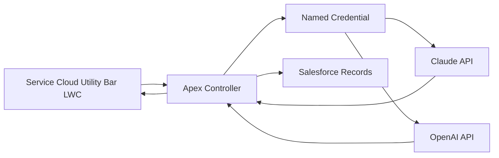
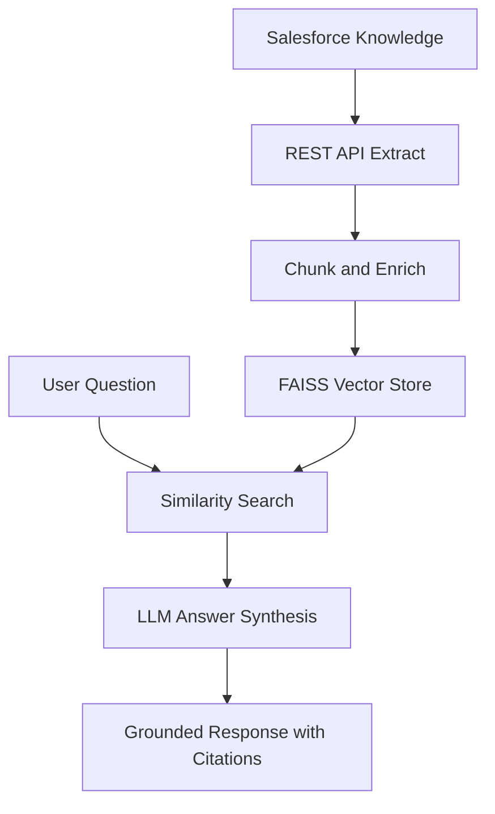

# Salesforce Agentic AI Toolkit

Practical reference patterns for embedding Claude and OpenAI into Salesforce workflows through governed Apex callouts, prompt construction, Lightning Web Components, and Python-based retrieval workflows.

> Reference architecture based on anonymized patterns from enterprise engagements. No client data included.
>
> Reference patterns based on anonymized enterprise work.

## Architecture

## What Is Included

- Apex callout classes for Claude and OpenAI using Named Credentials.
- Prompt builder utilities for lead scoring, case summarization, and next-best-action.
- LWC utility panel for displaying AI assistance in Service Cloud.
- Python LangChain example using Salesforce REST API as a tool.
- Python RAG pipeline using Salesforce Knowledge, FAISS, and Claude answer synthesis.
- Prompt templates with guardrails and structured output instructions.

## Setup

1. Install Python dependencies with `pip install -r requirements.txt`.
Note: Knowledge__kav is the default API name for Salesforce Knowledge articles. Verify your org's Knowledge object API name before deploying the RAG pipeline — it may differ depending on org configuration and package version.
2. Configure Salesforce connected app credentials for Python examples.
3. Configure Named Credentials in Salesforce:
   - `callout:Anthropic_API`
   - `callout:OpenAI_API`
4. Deploy Apex and LWC into a Salesforce DX project.
5. Assign the LWC to the Service Cloud utility bar.
6. Store API keys in secure credential stores only. Do not hard-code secrets.

## Governance Notes

All examples are illustrative. Validate prompts, record access, retention policies, and user consent before production use. For regulated workflows, store prompt versions, input classifications, response metadata, and human approval evidence.
